<br/>

<!-- badges: start -->
[](https://CRAN.R-project.org/package=rGEDI)
[](https://github.com/carlos-alberto-silva/rGEDI/actions/workflows/R-CMD-check.yaml)


[](https://cran.r-project.org/package=rGEDI)
<!-- badges: end -->

**rGEDI: An R Package for NASA's Global Ecosystem Dynamics Investigation
(GEDI) Data Visualizing and Processing.**

Authors: Carlos Alberto Silva, Caio Hamamura, Ruben Valbuena, Steven Hancock,
Adrian Cardil, Eben N. Broadbent, Danilo R. A. de Almeida, Celso H. L. Silva
Junior, and Carine Klauberg.

The original rGEDI workflow provides functions for downloading, visualizing,
clipping, gridding, simulating, and exporting GEDI data. The expanded package
also searches, streams, filters, summarizes, models, and maps NASA GEDI data.

`rGEDI` searches, downloads, streams, reads, filters, clips, summarizes,
simulates, models, and maps NASA Global Ecosystem Dynamics Investigation
(GEDI) data. It supports footprint products GEDI01_B, GEDI02_A, GEDI02_B,
and GEDI04_A, as well as raster products GEDI03 and GEDI04_B.

The examples below form one workflow. Local examples use the real GEDI subsets
bundled with the package. Cloud and Google Earth Engine examples use real NASA
and Earth Engine services. The scripts that regenerated the displayed assets
are [`readme/build-local-examples.R`](readme/build-local-examples.R) and
[`readme/build-modern-examples.R`](readme/build-modern-examples.R). A generated
[rGEDI function reference manual](output/pdf/rGEDI-reference-manual.pdf) is also
available for review.

# Getting Started

## 1 Installation

```r
# Development release
install.packages(
  "rGEDI",
  repos = c("https://carlos-alberto-silva.r-universe.dev",
            "https://cloud.r-project.org")
)

# Current GitHub master
# install.packages("remotes")
# remotes::install_github("carlos-alberto-silva/rGEDI")

library(rGEDI)
library(data.table)
library(sf)
library(terra)
```

### Configure Python and Google Earth Engine

As in the ICESat2VegR workflow, rGEDI uses three Python packages through
`reticulate`:

1. [`earthaccess`](https://github.com/earthaccess-dev/earthaccess) finds and
   authenticates Earthdata Cloud objects.
2. [`h5py`](https://github.com/h5py/h5py) reads HDF5 content streamed from the
   cloud.
3. [`earthengine-api`](https://github.com/google/earthengine-api) samples
   predictors and creates wall-to-wall maps in Google Earth Engine.

Run the configuration once. It installs Miniconda when needed and creates the
package Python environment. Restart R if the installer asks you to do so.

```r
rGEDI_configure(install = TRUE)
ee_initialize(project = "your-google-cloud-project")
```

Verify the active Python and required modules:

```r
safely <- function(expr, default = NA) tryCatch(expr, error = function(e) default)
have_reticulate <- requireNamespace("reticulate", quietly = TRUE)
py_ready <- have_reticulate &&
  !inherits(try(reticulate::py_config(), silent = TRUE), "try-error")

status <- list(
  rGEDI_loaded = "package:rGEDI" %in% search(),
  python_used = if (have_reticulate)
    safely(reticulate::py_discover_config()$python) else NA,
  h5py = if (py_ready) reticulate::py_module_available("h5py") else FALSE,
  earthaccess = if (py_ready)
    reticulate::py_module_available("earthaccess") else FALSE,
  ee = if (py_ready) reticulate::py_module_available("ee") else FALSE
)
print(status)
```

## 2 Example study site

The package contains Cerrado forest stands and small matched GEDI Level 1B,
Level 2A, and Level 2B granules.

```r
stands_path <- system.file("extdata", "stands_cerrado.shp", package = "rGEDI")
study_area <- sf::st_read(stands_path, quiet = TRUE)
box <- sf::st_bbox(study_area)

xmin <- unname(box["xmin"]); xmax <- unname(box["xmax"])
ymin <- unname(box["ymin"]); ymax <- unname(box["ymax"])
daterange <- c("2019-04-18", "2019-04-19")
outdir <- file.path(tempdir(), "rGEDI")
dir.create(outdir, showWarnings = FALSE)
```

<p align="center">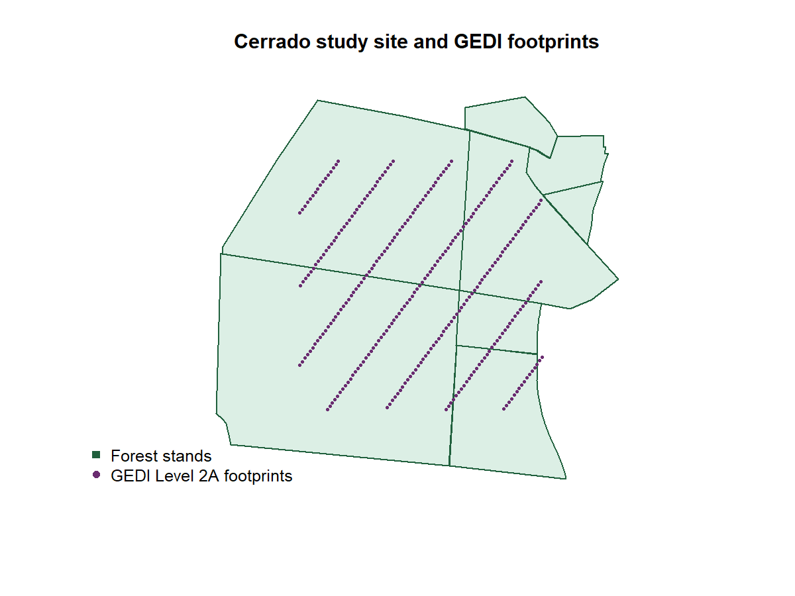</p>

## 3 Find GEDI data and download

### 3.1 Find GEDI granules

`gedifinder()` queries NASA CMR. Use the official short names and current
versions. The returned character vector contains direct HTTPS links.

```r
products <- c(
  GEDI01_B = "002", GEDI02_A = "002", GEDI02_B = "002",
  GEDI03 = "001", GEDI04_A = "003", GEDI04_B = "002"
)

granules <- lapply(names(products), function(product) {
  gedifinder(
    product,
    ul_lat = ymax, ul_lon = xmin,
    lr_lat = ymin, lr_lon = xmax,
    version = products[[product]], daterange = daterange,
    cloud_computing = FALSE, persist = TRUE
  )
})
names(granules) <- names(products)
head(granules$GEDI02_A)
```

To retrieve every production granule in one orbit, supply its orbit number
instead of a bounding box. CMR returns the four parts in acquisition order.

```r
orbit_granules <- gedifinder(
  "GEDI02_A", version = "002", orbit = "O01964", return = "table"
)
orbit_granules[, c("granule_id", "orbit", "granule_part")]
stopifnot(nrow(orbit_granules) == 4L)
```

Set `cloud_computing = TRUE` for cloud-hosted links suitable for streaming.
An HTTPS Earthdata Cloud URL works on Windows, macOS, and Linux. Direct
`s3://` reads require code running in AWS `us-west-2`, which is a NASA bucket
policy rather than an operating-system limitation.

### 3.2 Download the granules

Keep credentials outside scripts. `earthdata_login()` can use a standard
`~/.netrc`, the `NETRC` environment variable, or a path passed at run time.

```r
# Sys.setenv(NETRC = "/secure/path/to/.netrc")
earthdata_login()

gediDownload(granules$GEDI01_B[1], outdir)
gediDownload(granules$GEDI02_A[1], outdir)
gediDownload(granules$GEDI02_B[1], outdir)
gediDownload(granules$GEDI04_A[1], outdir)

# GEDI03 and GEDI04_B searches may return several metric GeoTIFFs.
gediDownload(granules$GEDI03[1], outdir)
gediDownload(granules$GEDI04_B[1], outdir)
```

`gediDownload()` accepts the complete URL vector and invisibly returns the
downloaded paths. Orbit `O01964` is about 9.2 GB, so ensure sufficient disk
space before running this example.

```r
orbit_files <- gediDownload(orbit_granules$url, outdir)
```

## 4 Read GEDI products

### Read downloaded products

```r
level1b_file <- list.files(outdir, "GEDI01_B.*\\.h5$", full.names = TRUE)[1]
level2a_file <- list.files(outdir, "GEDI02_A.*\\.h5$", full.names = TRUE)[1]
level2b_file <- list.files(outdir, "GEDI02_B.*\\.h5$", full.names = TRUE)[1]
level4a_file <- list.files(outdir, "GEDI04_A.*\\.h5$", full.names = TRUE)[1]
level3_file  <- list.files(outdir, "GEDI03.*\\.tif$", full.names = TRUE)[1]
level4b_file <- list.files(outdir, "GEDI04_B.*\\.tif$", full.names = TRUE)[1]

level1b_full <- readLevel1B(level1b_file)
level2a_full <- readLevel2A(level2a_file)
level2b_full <- readLevel2B(level2b_file)
level3  <- readLevel3(level3_file)
level4a_full <- readLevel4A(level4a_file)
level4b <- readLevel4B(level4b_file)
```

The bundled subsets can be opened without a network connection:

```r
level1b_path <- unzip(system.file("extdata",
  "GEDI01_B_2019108080338_O01964_T05337_02_003_01_sub.zip",
  package = "rGEDI"), exdir = outdir)
level2a_path <- unzip(system.file("extdata",
  "GEDI02_A_2019108080338_O01964_T05337_02_001_01_sub.zip",
  package = "rGEDI"), exdir = outdir)
level2b_path <- unzip(system.file("extdata",
  "GEDI02_B_2019108080338_O01964_T05337_02_001_01_sub.zip",
  package = "rGEDI"), exdir = outdir)

level1b <- readLevel1B(level1b_path)
level2a <- readLevel2A(level2a_path)
level2b <- readLevel2B(level2b_path)
```

### Stream GEDI HDF5 data from Earthdata Cloud

```r
cloud_urls <- gedifinder(
  "GEDI04_A",
  ul_lat = ymax, ul_lon = xmin, lr_lat = ymin, lr_lon = xmax,
  version = "003", daterange = daterange,
  cloud_computing = TRUE, persist = TRUE
)

# readLevel1B(), readLevel2A(), and readLevel2B() accept the same URL type.
level4a_cloud <- readLevel4A(cloud_urls[1])
level4a_cloud$beams
```

Level 3 and Level 4B are raster collections. Download the selected metric
GeoTIFF first and then use `readLevel3()` or `readLevel4B()`. This avoids the
Earthdata redirect restrictions encountered by GDAL virtual-file reads.

## 5 Extract, quality-filter, clip, rasterize, summarize, and simulate footprint-level products

### 5.1 Extract the Reference Ground Track and plot the GIF animation

`getGEDITrack()` standardizes coordinates, beam names, and acquisition order
from a Level 1B, 2A, 2B, or 4A object, an extracted table, or a list of open
granules. NASA partitions one GEDI orbit into four consecutive production
granules (`_01` through `_04`). `gedifinder(orbit = ...)` retrieves every part;
`every` thins the display without changing acquisition order.

```r
stopifnot(length(orbit_files) == 4L)

orbit_h5 <- lapply(sort(orbit_files), readLevel2A)
rgt <- getGEDITrack(orbit_h5, every = 200, segment_gaps = FALSE)
head(rgt)

plot_gedi_orbit_animation(
  orbit_h5,
  output_file = file.path(outdir, "gedi-orbit-animation.gif"),
  title = "GEDI aboard the International Space Station",
  duration = 8, every = 200, launch = FALSE
)

# Use .html for the interactive 3D globe.
plot_gedi_orbit_animation(
  orbit_h5, output_file = file.path(outdir, "gedi-orbit-animation.html"),
  every = 200,
  track_speed = 2, earth_rotation_speed = 2,
  launch = interactive()
)
```

The displayed example was generated from the four complete Level 2A V002
granules for orbit `O01964`. Its 22,350 sampled footprints span all eight GEDI
beams, four granule parts, 81.6 minutes, and latitudes from -50.346 to 51.825
degrees. The reproducible cloud-reading and animation script is
[`readme/build-complete-orbit.R`](readme/build-complete-orbit.R).

The GIF follows the ICESat2VegR presentation while showing the correct GEDI
platform: GEDI is mounted on the International Space Station. GEDI operates at
1064 nm in the near infrared; the red beam and track visualize that invisible
laser pulse and connect the ISS payload to the accumulating reference ground
track. Every displayed ISS position follows the time-ordered geolocation from
the most complete beam in the open HDF5 granule. Following the ICESat2VegR
animation, the textured Earth rotates independently while the NASA ISS image,
GEDI payload label, red laser, and red orbit track move together in 3D. The
HTML controls adjust both track playback and Earth rotation speed.

<p align="center">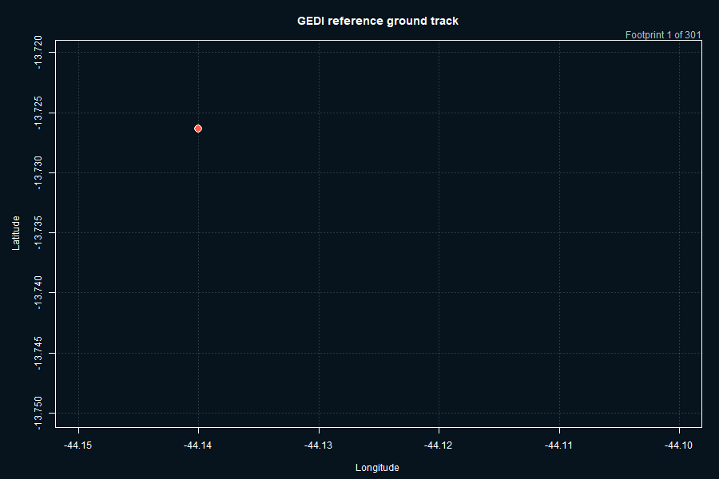</p>

### 5.2 Extract the data

#### Get GEDI pulse geolocation (GEDI Level 1B)

```r
level1b_geo <- getLevel1BGeo(level1b)
head(level1b_geo)
```

The original rGEDI map is retained below. It shows the Level 1B footprints
over high-resolution imagery.

<p align="center">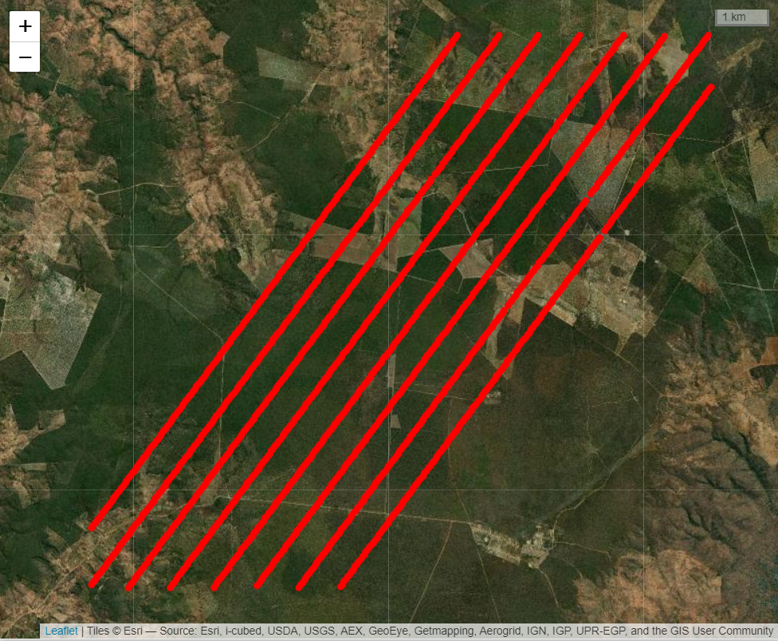</p>

#### Get GEDI full waveform (GEDI Level 1B)

```r
shot <- level1b_geo$shot_number[1]
waveform <- getLevel1BWF(level1b, shot_number = shot)
plot(waveform)
```

<p align="center">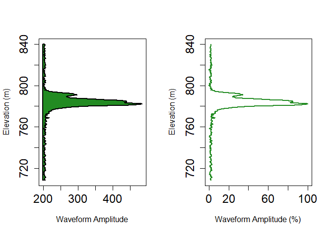</p>

#### Get GEDI elevation and height metrics (GEDI Level 2A)

```r
level2a_metrics <- getLevel2AM(level2a)
level2a_good <- level2a_metrics[
  quality_flag == 1 & degrade_flag == 0 & sensitivity >= 0.9
]
level2a_good[, .(beam, shot_number, elev_lowestmode, rh50, rh90, rh98, rh100)]
```

#### Plot waveform with RH metrics

```r
plotWFMetrics(level1b, level2a, shot_number = shot,
              rh = c(25, 50, 75, 90, 98))
```

<p align="center">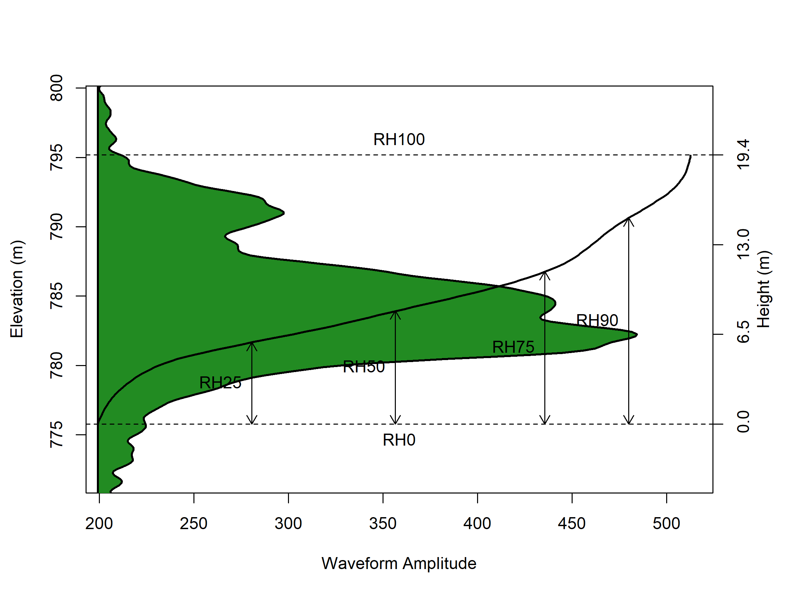</p>

<p align="center">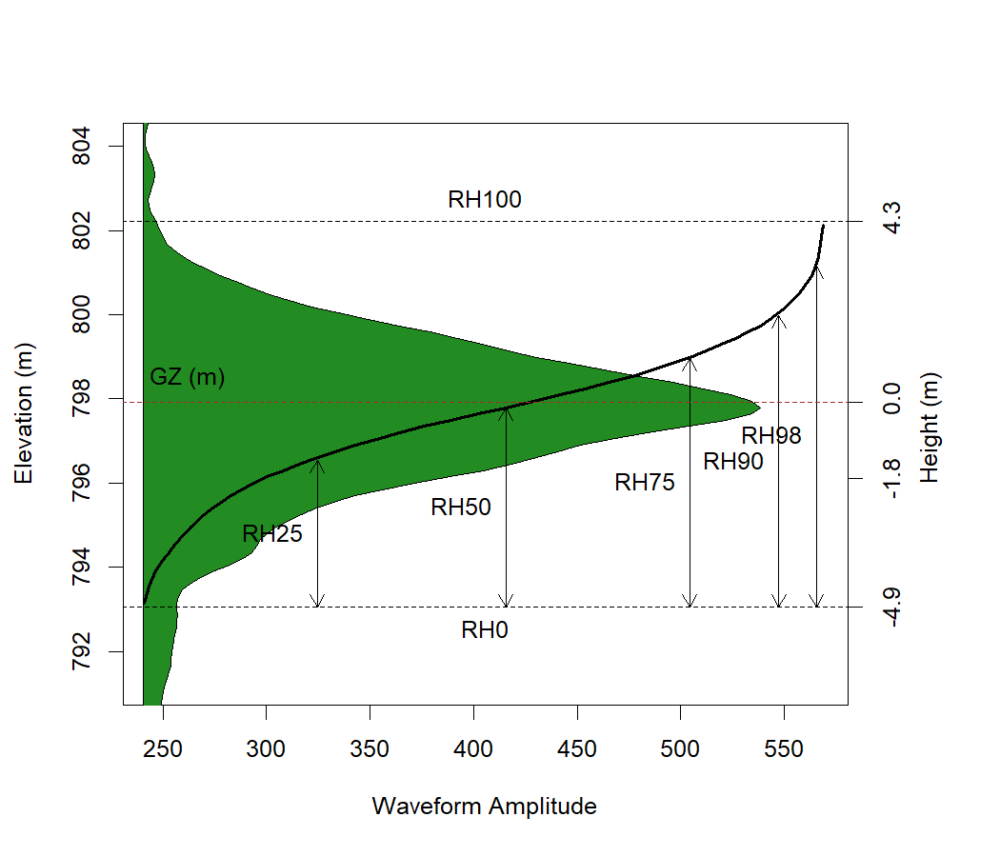</p>

#### Get GEDI vegetation biophysical variables (GEDI Level 2B)

```r
level2b_vpm <- getLevel2BVPM(level2b)
level2b_good <- level2b_vpm[l2b_quality_flag == 1 & sensitivity >= 0.9]
level2b_good[, .(beam, shot_number, rh100, pai, fhd_normal, cover)]
```

#### Get and plot PAI and PAVD profiles (GEDI Level 2B)

```r
pai_profile  <- getLevel2BPAIProfile(level2b)
pavd_profile <- getLevel2BPAVDProfile(level2b)
profile_beam <- unique(pai_profile$beam)[1]
plotPAIProfile(pai_profile, beam = profile_beam)
plotPAVDProfile(pavd_profile, beam = profile_beam)
```

<p align="center">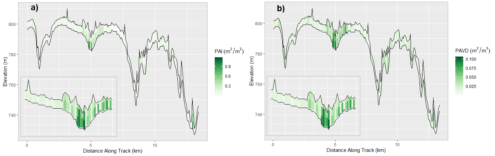</p>

<p align="center">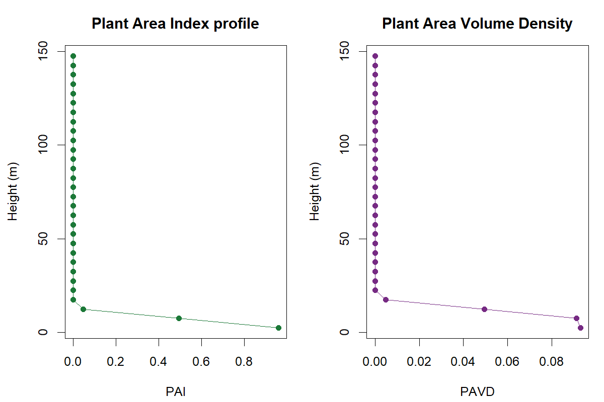</p>

#### Get GEDI aboveground biomass at footprint level (GEDI Level 4A)

```r
level4a_footprints <- getLevel4A(
  level4a_cloud,
  cols = c("beam", "shot_number", "delta_time", "lat_lowestmode",
           "lon_lowestmode", "agbd", "agbd_se", "sensitivity",
           "l4a_quality_flag_rel3", "degrade_include_flag",
           "elev_highestreturn_outlier_flag"),
  quality = TRUE
)
head(level4a_footprints)
```

<p align="center">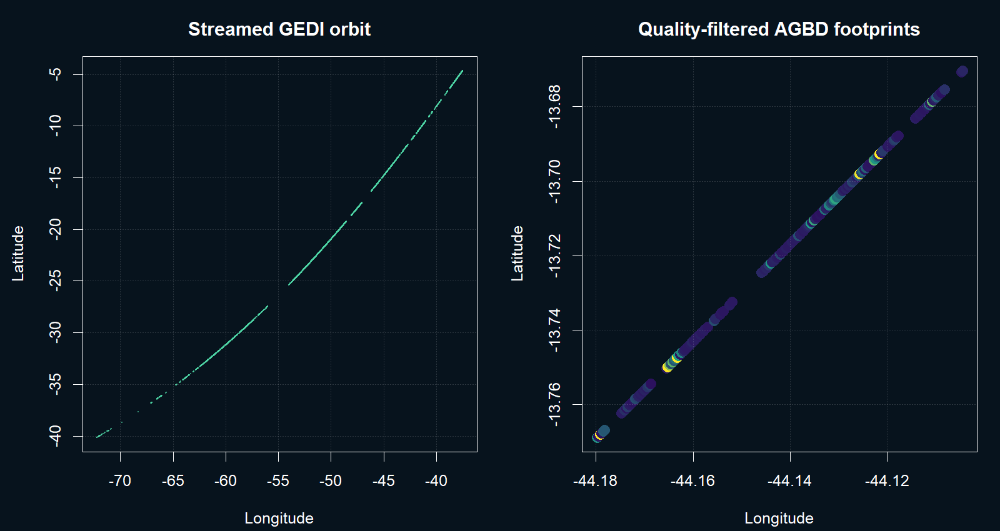</p>

### 5.3 Clip

Use the generic `clip()` function for every GEDI product. A bounding box uses
the rGEDI/terra coordinate order `c(xmin, xmax, ymin, ymax)`; polygons can be
`sf`, `sfc`, or `SpatVector` objects.

```r
bbox <- c(xmin, xmax, ymin, ymax)

# Open HDF5 products
level1b_clip <- clip(level1b, bbox,
  output = file.path(outdir, "level1b-clip.h5"))
level2a_clip <- clip(level2a, bbox,
  output = file.path(outdir, "level2a-clip.h5"))
level2b_clip <- clip(level2b, study_area,
  output = file.path(outdir, "level2b-clip.h5"))
level4a_clip <- clip(level4a, bbox)

# Extracted footprint tables and rasters
level2a_bbox <- clip(level2a_metrics, bbox)
level4a_geom <- clip(level4a_footprints, study_area)
level3_aoi <- clip(level3, vect(study_area))
level4b_bbox <- clip(level4b, bbox)
```

The product-specific functions shown below remain available when an explicit
function name is useful in a script.

#### Clip open GEDI HDF5 objects

Level 1B, 2A, and 2B clippers write valid subset HDF5 files and return open
GEDI objects. Level 4A uses the extracted footprint table because its public
API works at footprint level.

```r
level1b_clip <- clipLevel1B(level1b, xmin, xmax, ymin, ymax,
                            output = file.path(outdir, "level1b-clip.h5"))
level2a_clip <- clipLevel2A(level2a, xmin, xmax, ymin, ymax,
                            output = file.path(outdir, "level2a-clip.h5"))
level2b_clip <- clipLevel2B(level2b, xmin, xmax, ymin, ymax,
                            output = file.path(outdir, "level2b-clip.h5"))
level4a_clip <- clipLevel4A(level4a_footprints, xmin, xmax, ymin, ymax)
```

Clip the HDF5 products by geometry:

```r
level1b_geom <- clipLevel1BGeometry(level1b, study_area,
  output = file.path(outdir, "level1b-geometry"))
level2a_geom <- clipLevel2AGeometry(level2a, study_area,
  output = file.path(outdir, "level2a-geometry"))
level2b_geom <- clipLevel2BGeometry(level2b, study_area,
  output = file.path(outdir, "level2b-geometry"))
level4a_geom <- clipLevel4AGeometry(level4a_footprints, study_area)
```

#### Clip extracted `data.table` objects

```r
level1b_geo_bbox <- clipLevel1BGeo(level1b_geo, xmin, xmax, ymin, ymax)
level2a_bbox <- clipLevel2AM(level2a_metrics, xmin, xmax, ymin, ymax)
level2b_bbox <- clipLevel2BVPM(level2b_vpm, xmin, xmax, ymin, ymax)

level1b_geo_geom <- clipLevel1BGeoGeometry(level1b_geo, study_area)
level2a_geom_dt <- clipLevel2AMGeometry(level2a_metrics, study_area)
level2b_geom_dt <- clipLevel2BVPMGeometry(level2b_vpm, study_area)

plot(st_geometry(study_area))
points(level2a_geom_dt$lon_lowestmode, level2a_geom_dt$lat_lowestmode,
       pch = 16, col = "#762A83")
```

<p align="center">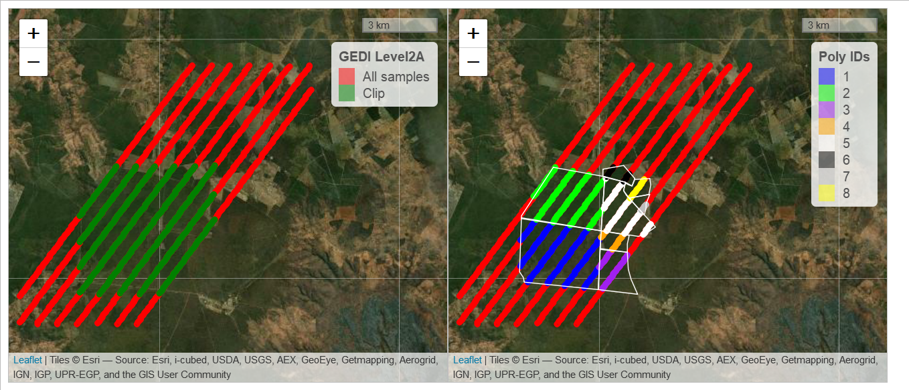</p>

### 5.4 Compute descriptive statistics

```r
metric_set <- function(x) c(
  n = sum(is.finite(x)), mean = mean(x, na.rm = TRUE),
  sd = sd(x, na.rm = TRUE), min = min(x, na.rm = TRUE),
  max = max(x, na.rm = TRUE)
)

rh98_stats <- polyStatsLevel2AM(
  level2a_geom_dt, func = metric_set(rh98), id = NULL
)
cover_stats <- polyStatsLevel2BVPM(
  level2b_geom_dt, func = metric_set(cover), id = NULL
)
agbd_stats <- polyStatsLevel4A(
  level4a_footprints, study_area, metric = "agbd", fun = metric_set
)
```

### 5.5 Compute grids with descriptive statistics

```r
rh98_grid <- gridStatsLevel2AM(
  level2a_metrics, func = mean(rh98, na.rm = TRUE), res = 0.002
)
cover_grid <- gridStatsLevel2BVPM(
  level2b_vpm, func = mean(cover, na.rm = TRUE), res = 0.002
)
agbd_grid <- gridStatsLevel4A(
  level4a_footprints, metric = "agbd", fun = mean,
  res = 0.002, na.rm = TRUE
)
```

<p align="center">
  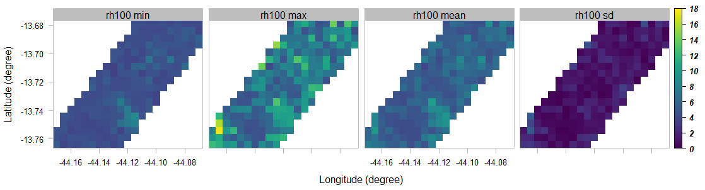
  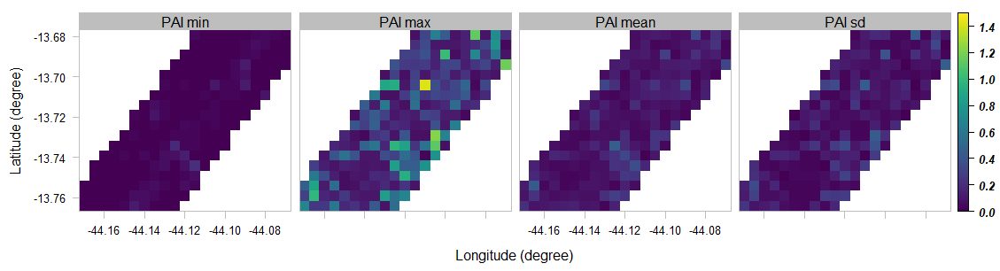
</p>

<p align="center">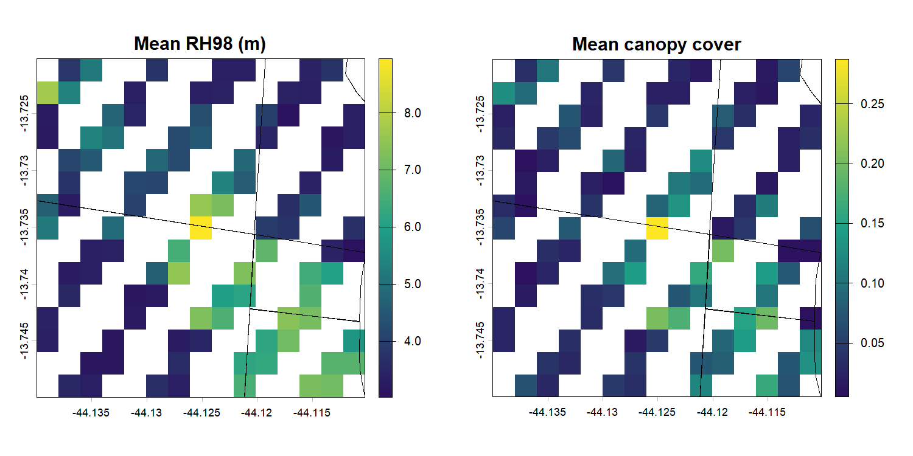</p>

### 5.6 Convert to `SpatVector`

`to_vect()` detects the standard coordinate fields for Level 2A, Level 2B,
and Level 4A tables.

```r
level2a_vect <- to_vect(level2a_metrics)
level2b_vect <- to_vect(level2b_vpm)
level4a_vect <- to_vect(level4a_footprints)
```

## 6 Predicting and rasterizing local GEDI-derived forest attributes with machine learning

### 6.1 Create a model for GEDI data

This example reads the real Level 2A table generated from the bundled granule.

```r
model_data <- fread("readme/gedi-level2a-example.csv")
predictors <- c("rh50", "rh75", "rh90", "rh100", "elev_lowestmode")

selection <- varSel(
  model_data[, ..predictors], model_data$rh98,
  method = "rfe", threshold = 0, seed = 42, ntree = 200
)
plot(selection, which = "importance", main = "RFE predictor importance")
selected_predictors <- selection$selvars

fit <- fit_model(
  model_data[, ..selected_predictors], model_data$rh98,
  method = "randomForest", test = "kfold", k = 5,
  seed = 42, ntree = 300
)
fit$stats_test
```

### 6.2 Predict field or fuel data

For a field response such as fuel load, join measured plots to GEDI footprints
by spatial proximity or shot ID, then pass the measured column as `y`. The
following call predicts the real `rh98` response in this reproducible example.

```r
predicted <- predictGEDI(fit, model_data, name = "predicted_rh98")

# For a measured fuel-load table, the corresponding call is:
# fuel_fit <- fit_model(fuel_training[, ..predictor_names],
#                       fuel_training$fuel_load,
#                       method = "randomForest", test = "kfold", k = 5)
```

### 6.3 Rasterize predicted data

```r
rh98_prediction <- rasterizeGEDI(
  predicted, metric = "predicted_rh98", res = 0.002,
  lon = "lon_lowestmode", lat = "lat_lowestmode", fun = mean
)
plot(rh98_prediction)
```

<p align="center">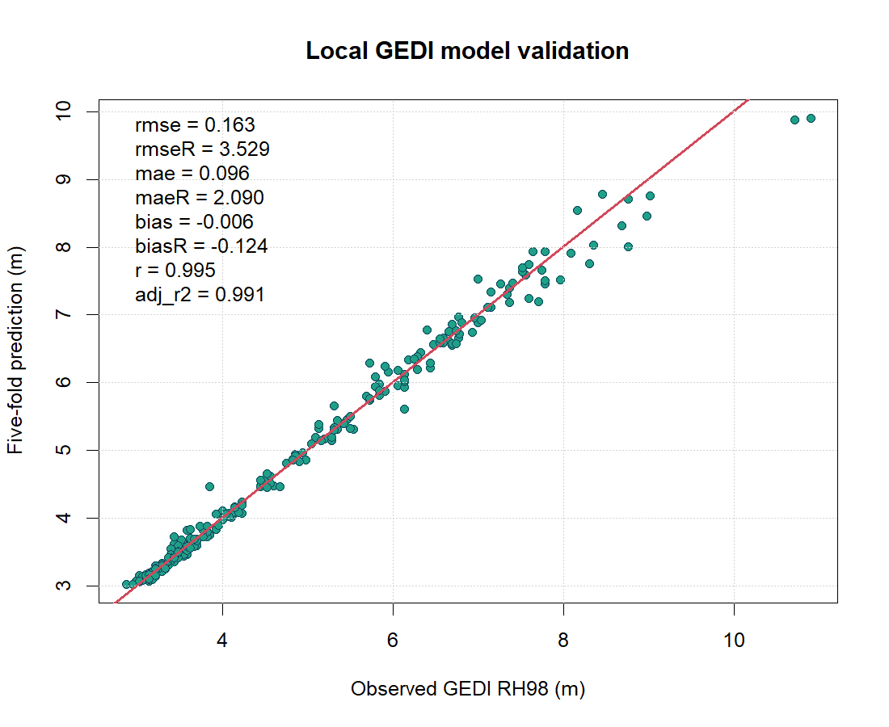</p>

## 7 Extract, clip, and summarize GEDI-derived grid products

```r
level3 <- readLevel3(level3_file)
level4b <- readLevel4B(level4b_file)
```

### 7.1 Visualization

```r
plotLevel3(level3, main = "GEDI Level 3 metric")
plotLevel4B(level4b, main = "GEDI Level 4B AGBD")
```

### 7.2 Clip using a bounding box or geometry

```r
level3_bbox <- clipLevel3(level3, c(xmin, xmax, ymin, ymax))
level4b_bbox <- clipLevel4B(level4b, c(xmin, xmax, ymin, ymax))
level3_aoi <- clipLevel3(level3, vect(study_area))
level4b_aoi <- clipLevel4B(level4b, vect(study_area))
level3_values <- extractLevel3(level3, vect(study_area))
level4b_values <- extractLevel4B(level4b, vect(study_area))
```

### 7.3 Compute Level 4B descriptive statistics within an AOI

```r
level4b_stats <- polyStatsLevel4B(
  level4b, vect(study_area), fun = mean, na.rm = TRUE
)
level4b_stats
```

<p align="center">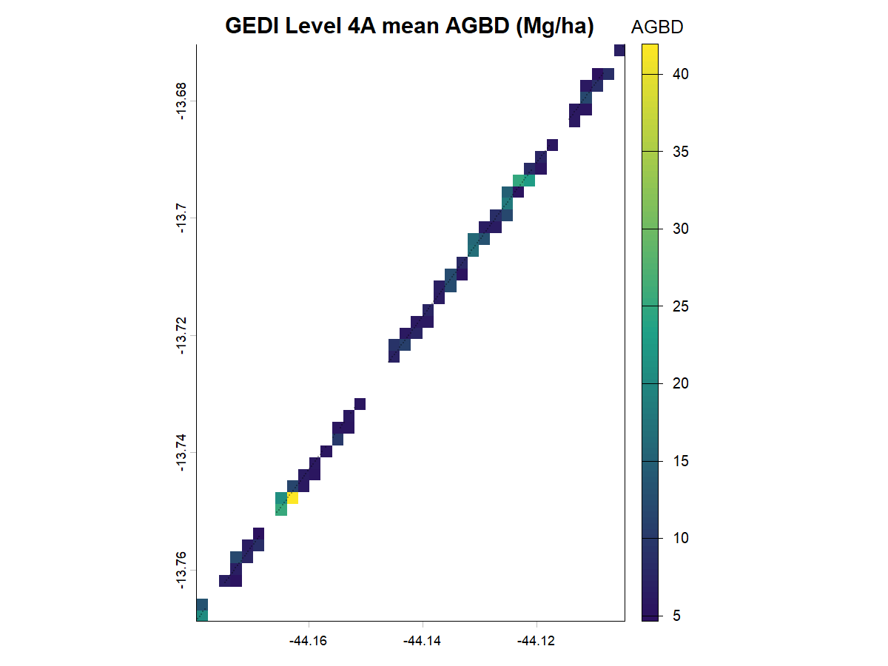</p>

## 8 Simulating GEDI full-waveform data from ALS point clouds

`gediWFSimulator()` accepts LAS/LAZ files, `lidR::LAS` objects, `SpatVector`
points, or an X/Y/Z table. Its focused implementation follows Steven Hancock's
`gediRat` core: Gaussian footprint weighting, local ALS-density correction,
vertical binning, Gaussian pulse convolution, LAS class 2 ground separation,
and unit-integral normalization. Vectorized bin accumulation keeps this path
portable and fast without the native library stack that caused CRAN problems.

```r
set.seed(11)
als <- data.frame(
  X = c(runif(1500, -12, 12), runif(3500, -12, 12)),
  Y = c(runif(1500, -12, 12), runif(3500, -12, 12)),
  Z = c(rnorm(1500, 0, 0.25), pmax(0, rnorm(3500, 17, 6))),
  Classification = c(rep(2L, 1500), rep(5L, 3500))
)
```

### 8.1 Extract metrics without adding waveform noise

```r
sim_clean <- gediWFSimulator(
  als, output = file.path(outdir, "sim-clean.h5"),
  coords = c(0, 0), noise = 0, seed = 11
)
metrics_clean <- gediWFMetrics(sim_clean)
metrics_clean[, .(cover, rh50, rh90, rh100, waveEnergy)]
```

### 8.2 Extract metrics after adding waveform noise

```r
sim_noisy <- gediWFSimulator(
  als, output = file.path(outdir, "sim-noisy.h5"),
  coords = c(0, 0), noise = 0.03, seed = 11
)
metrics_noisy <- gediWFMetrics(sim_noisy)
metrics_noisy[, .(cover, rh50, rh90, rh100, waveEnergy)]
```

<p align="center">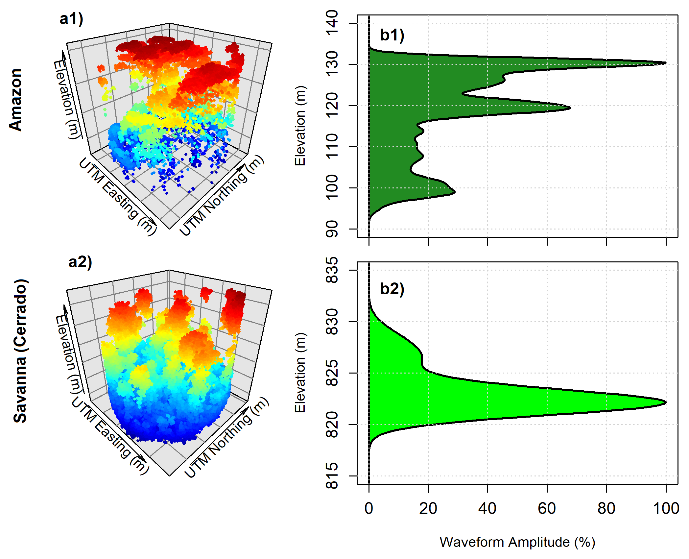</p>

<p align="center">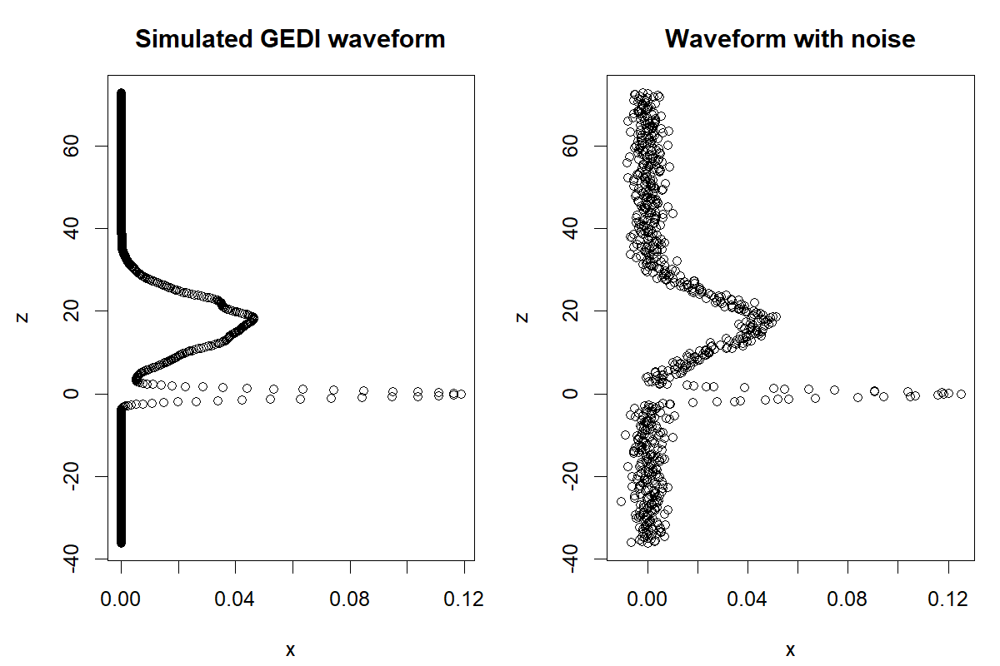</p>

## 9 Upscaling GEDI products using AlphaEarth Embeddings

### 9.1 Introduction

This workflow models real quality-filtered GEDI Level 4A aboveground biomass
density (`agbd`) with the 64-band AlphaEarth annual embedding plus terrain
predictors in Google Earth Engine (GEE). It follows the ICESat2VegR sequence,
adapted to GEDI footprints: discover Level 4A data, apply product quality
flags, create a spatially balanced footprint sample, extract AlphaEarth and
terrain values, select predictors, validate a Random Forest model, train the
equivalent GEE regressor, predict the AOI, visualize it, and export GeoTIFF.

AlphaEarth bands `A00`–`A63` are general-purpose satellite embeddings. The
terrain variables (`elevation`, `slope`, and `aspect`) provide explicit
topographic context. Longitude and latitude can also be included, but their
importance should be interpreted carefully because they may encode geographic
location rather than transferable ecological relationships.

### 9.2 Code availability

A clean end-to-end script is installed with the package and can also be opened
directly from the repository:

**[Download the GEDI AlphaEarth upscaling workflow](inst/scripts/upscaling_alphaearth_workflow.R)**

The script covers GEDI discovery and cloud reading, Level 4A quality filtering,
spatial sampling, ancillary extraction, RFE, independent validation,
wall-to-wall prediction, visualization, and Drive export. The separate
[`readme/build-modern-examples.R`](readme/build-modern-examples.R) script
regenerates the figures and data artifacts displayed on this page.

### 9.3 Install and load required packages

```r
repos <- c(
  rgedi = "https://carlos-alberto-silva.r-universe.dev",
  CRAN = "https://cloud.r-project.org"
)
need <- c(
  "rGEDI", "reticulate", "sf", "terra", "data.table",
  "randomForest", "leaflet"
)
missing <- need[!vapply(need, requireNamespace, logical(1), quietly = TRUE)]
if (length(missing)) install.packages(missing, repos = repos, dependencies = TRUE)

suppressPackageStartupMessages({
  library(rGEDI)
  library(data.table)
  library(sf)
  library(terra)
})
```

### 9.4 Read AOI and define the date range

```r
aoi <- sf::st_make_valid(sf::st_transform(study_area, 4326))
aoi_box <- sf::st_bbox(aoi)
study_extent <- unname(aoi_box[c("xmin", "xmax", "ymin", "ymax")])
daterange <- c("2019-04-18", "2019-04-19")
start_year <- 2019
end_year <- 2019
```

### 9.5 Package configuration

Configure the Python environment once. Authentication remains in the standard
user-level stores managed by Earthdata and the Earth Engine API; it is never
placed in this README or the workflow script.

```r
rGEDI_configure(install = TRUE)

# Reads NETRC or ~/.netrc. Do not put usernames or passwords in scripts.
earthdata_login()

# Set this in the R session or the user's environment, outside the repository.
# Sys.setenv(EE_PROJECT = "your-google-cloud-project")
ee_project <- Sys.getenv("EE_PROJECT", unset = "")
if (!nzchar(ee_project)) stop("Set EE_PROJECT to your Google Cloud project ID.")
ee <- ee_initialize(project = ee_project)
```

### 9.6 Build the AlphaEarth predictor stack and extract footprint values

Start from the quality-filtered Level 4A footprints extracted in Section 5.2.
The `spacedSampling()` step reduces spatial clustering before predictors are
sampled from the 10 m AlphaEarth embedding at a 30 m working scale.

```r
level4a_aoi <- clipLevel4AGeometry(level4a_footprints, aoi)
level4a_aoi <- level4a_aoi[is.finite(agbd) & agbd >= 0]

set.seed(42)
footprint_sample <- sampleGEDI(
  level4a_aoi,
  spacedSampling(size = min(500L, nrow(level4a_aoi)), radius = 25)
)
footprint_sample$sample_id <- seq_len(nrow(footprint_sample))

stack <- ee_build_AlphaEarth_embedding_terrain_stack(
  aoi, start_year, end_year, add_lonlat = TRUE
)
bands <- reticulate::py_to_r(stack$bandNames()$getInfo())
predictor_names <- c(
  grep("^A[0-9]{2}$", bands, value = TRUE),
  intersect(
    c("elevation", "slope", "aspect", "longitude", "latitude"),
    bands
  )
)

training <- extractEE(
  stack$select(as.list(predictor_names)),
  footprint_sample, scale = 30, chunk_size = 250
)

# Restore coordinates if Earth Engine returned only feature properties.
coordinates <- as.data.table(footprint_sample)[, .(
  sample_id, lon_lowestmode, lat_lowestmode
)]
if (!all(c("lon_lowestmode", "lat_lowestmode") %in% names(training))) {
  training <- merge(training, coordinates, by = "sample_id",
                    all.x = TRUE, sort = FALSE)
}

complete <- training[
  complete.cases(training[, c("agbd", predictor_names), with = FALSE])
]
fwrite(complete, file.path(outdir, "gedi-alphaearth-training.csv"))
head(complete[, c("agbd", head(predictor_names, 6)), with = FALSE])
```

### 9.7 Visualize the predictor stack as false-color RGB

```r
rgb <- stack$select(c("A00", "A20", "A40"))
rgb_map <- map_view(
  list(`AlphaEarth RGB` = rgb),
  vis = list(`AlphaEarth RGB` = list(
    bands = c("A00", "A20", "A40"), min = -0.06, max = 0.12
  )), aoi = aoi
)
rgb_map
```

<p align="center">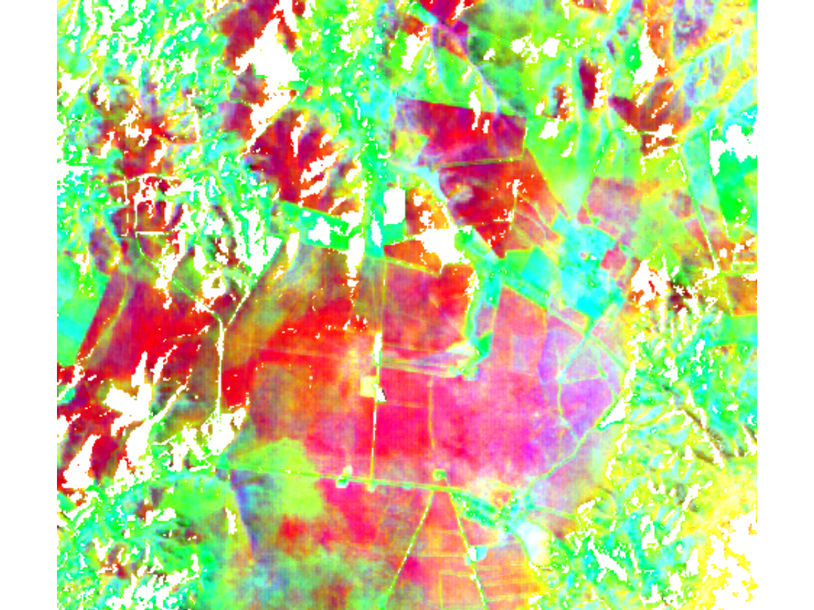</p>

### 9.8 Variable selection with RFE

RFE repeatedly removes the least useful predictor and chooses the smallest
subset within one standard error of the minimum out-of-bag error. Green bars
in the importance plot identify the retained variables.

```r
selection <- varSel(
  complete[, ..predictor_names], complete$agbd,
  method = "rfe", threshold = 0, seed = 42,
  ntree = 200
)
best_predictors <- selection$selvars
print(best_predictors)

par(mfrow = c(1, 2), mar = c(4.2, 7, 3, 1))
plot(selection, which = "importance")
plot(selection, which = "rfe")
par(mfrow = c(1, 1))
```

<p align="center">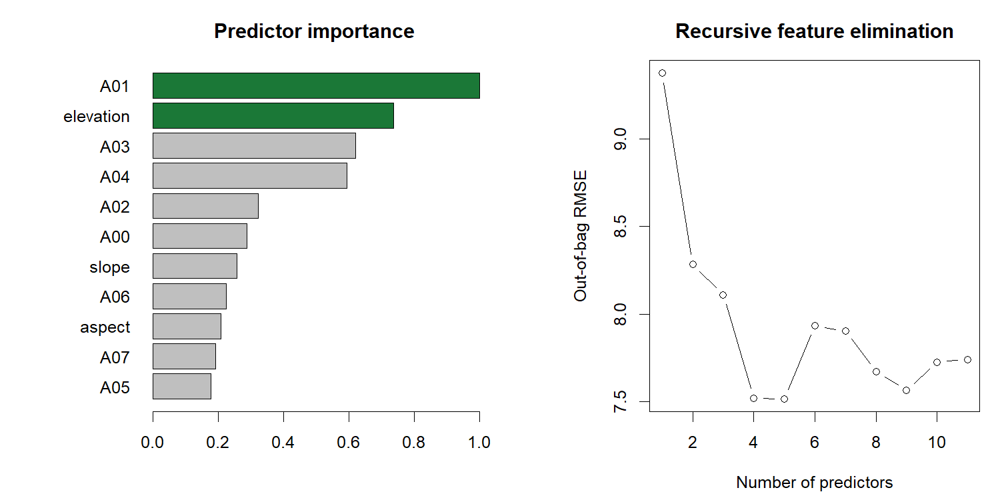</p>

### 9.9 Train/test split and fit a Random Forest model

Use a reproducible 70%/30% train/test split to estimate performance on GEDI
footprints that were not used to fit each validation model. The final model
stored in `fit$model` is refitted with all complete observations for subsequent
prediction.

```r
fit <- fit_model(
  complete[, ..best_predictors], complete$agbd,
  method = "randomForest", test = "split", test_size = 0.30,
  seed = 42, ntree = 500
)
fit$stats_train
fit$stats_test

ok <- is.finite(fit$validation)
plot(
  fit$response[ok], fit$validation[ok],
  pch = 21, bg = "#1fa187", col = "#173f5f",
  xlab = "Observed GEDI AGBD (Mg/ha)",
  ylab = "Holdout prediction (Mg/ha)"
)
abline(0, 1, col = "#d1495b", lwd = 2)
```

<p align="center">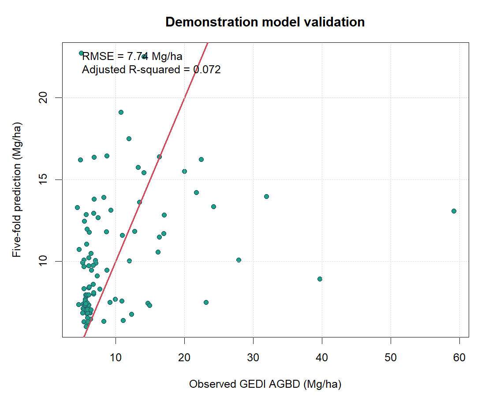</p>

### 9.10 Create a wall-to-wall aboveground biomass map in GEE

The local holdout model above provides accuracy diagnostics. For scalable
wall-to-wall prediction, train an equivalent regression forest inside Earth
Engine using the same response and selected predictors.

```r
ee_columns <- c(
  "agbd", "lon_lowestmode", "lat_lowestmode", best_predictors
)
training_vect <- to_vect(
  complete[, ..ee_columns],
  lon = "lon_lowestmode", lat = "lat_lowestmode"
)
training_ee <- vect_as_ee(training_vect)
training_ee <- training_ee$filter(
  ee$Filter$notNull(as.list(c("agbd", best_predictors)))
)
forest <- build_ee_forest(
  training_ee, response = "agbd", predictors = best_predictors,
  trees = 500, seed = 42
)
agbd_map <- map_create(forest, stack$select(as.list(best_predictors)),
                       aoi = aoi, name = "agbd")
```

### 9.11 Visualize the aboveground biomass map

```r
agbd_view <- map_view(
  list(`Predicted AGBD` = agbd_map),
  vis = list(`Predicted AGBD` = list(
    min = 0, max = 200,
    palette = c("#f7fcf5", "#74c476", "#00441b")
  )), aoi = aoi
)
agbd_view
```

<p align="center">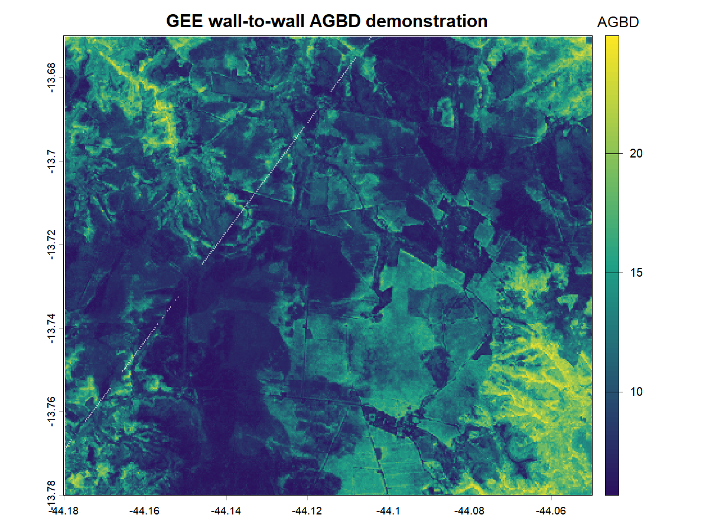</p>

### 9.12 Export the map to GeoTIFF via Google Drive

Use a Drive task for large exports. `start = TRUE` starts it immediately and
`ee_check_task_status()` reports its state.

```r
drive_task <- ee_image_to_drive(
  agbd_map,
  description = "rGEDI_AGBD_2019", folder = "EE_Exports",
  file_name_prefix = "rGEDI_AGBD_2019", region = aoi,
  scale = 30, start = TRUE
)
ee_check_task_status(drive_task, quiet = FALSE)

# Small images can be downloaded directly:
map_download(
  agbd_map, file.path(outdir, "rGEDI_AGBD_2019.tif"),
  region = aoi, scale = 30, overwrite = TRUE
)
```

## 10 Close the files

Close every local or streamed HDF5 object after use.

```r
close(level1b)
close(level2a)
close(level2b)
close(level1b_full)
close(level2a_full)
close(level2b_full)
close(level4a_full)
close(level4a_cloud)
invisible(lapply(orbit_h5, close))
close(level1b_clip)
close(level2a_clip)
close(level2b_clip)
lapply(level1b_geom, close)
lapply(level2a_geom, close)
lapply(level2b_geom, close)
close(sim_clean)
close(sim_noisy)
```

# References

- Dubayah, R. et al. (2020). The Global Ecosystem Dynamics Investigation:
  High-resolution laser ranging of the Earth's forests and topography.
  *Science of Remote Sensing*, 1, 100002.
- Hancock, S. et al. (2019). The GEDI simulator: A large-footprint waveform
  lidar simulator for calibration and validation of spaceborne missions.
  *Earth and Space Science*, 6, 294–310.
- Steven Hancock's reference implementation: <https://bitbucket.org/StevenHancock/gedisimulator/src/master/>
- GEDI project and product guides: <https://www.earthdata.nasa.gov/data/projects/gedi>

# Acknowledgements

GEDI data are provided by NASA's Land Processes Distributed Active Archive
Center. The package includes simulator work originally developed by Caio
Hamamura and contributors to the GEDI waveform-simulation ecosystem.

# Reporting issues

Report reproducible problems at
<https://github.com/carlos-alberto-silva/rGEDI/issues>. Include the rGEDI
version, operating system, product/version, a minimal example, and the complete
error message. Never include Earthdata or Google credentials.

# Citing rGEDI

```r
citation("rGEDI")
```

Silva, C. A. et al. (2020). rGEDI: NASA's Global Ecosystem Dynamics
Investigation (GEDI) data visualization and processing. *Remote Sensing*,
12(19), 3208. <https://doi.org/10.3390/rs12193208>

# Disclaimer

rGEDI is an independent open-source project and is not an official NASA
software product. Users remain responsible for checking product quality flags,
release notes, model assumptions, and the suitability of outputs for their
application.
